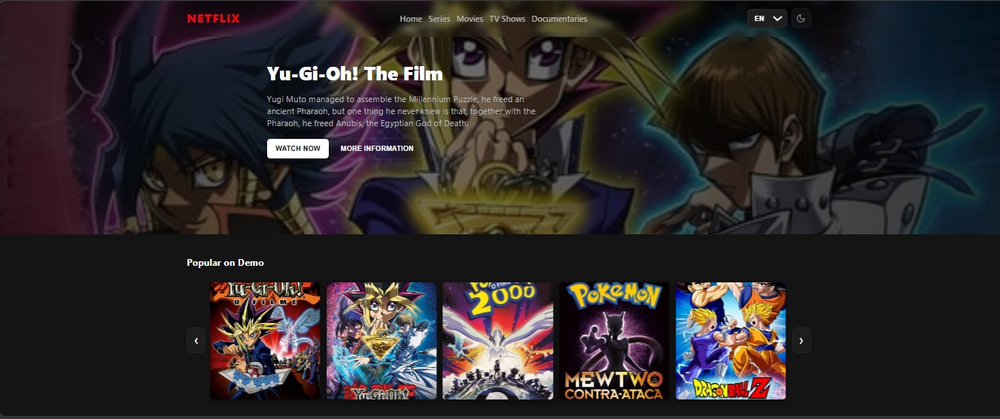

# Recreating the Netflix Interface

Project developed at Digital Innovation One's Bootcamp HTML Web Developer with guidance from specialist [Felipe Aguiar](https://github.com/felipeAguiarCode "Felipe Aguiar").
Learning how to rebuild the interface of the world's leading streaming site using simple technologies such as HTML5, CSS3 and JavaScript. In this project we learned how to structure a layout, CSS3 techniques with containers and variables, how to position elements with Flexbox and how to use JQuery plugins.

## Main Features

- **Theme mode**: dark (default) and light with moon/sun icons.
- **Multilingual**: EN-US (default), PT-BR, ES-ES.
- Thumbnail **carousel** with keyboard and touch support.
- **Accessibility**: `alt` on images, `aria-*` on controls, and focus visible for keyboard navigation.
- **Responsiveness**: layout adapted for desktop, tablet, and mobile.
- **Persistence**: current theme, language, and slide options saved in `localStorage`.

## How to run (locally)

- Open `index.html` in your browser (double-click or `File → Open`).
No server is required; the project runs locally.

## Quick customizations

- **Default theme**: in `script.js` change `const savedTheme = localStorage.getItem('demo_theme') || 'dark';` to `'light'`.
- **Default language**: in `script.js` change `const saveLang = localStorage.getItem('demo_lang') || 'en-US';` to `'pt-BR' or 'es-ES'`.
- **Items visible in the carousel**: adjust the `recalc()` function in `script.js` (limits and `visibleCount`).

## Best practices and recommendations

- **Top images**: generate WebP and use `srcset` for different resolutions.
- **Minification**: minify CSS/JS for production.
- **Contrast testing**: check the contrast of the text against the background (tools like Lighthouse).
- **Progressive enhancement**: keep content accessible even with JS disabled.

## Technologies used

- **HTML5**: semantic markup and login form.
- **CSS3**: styles with Flexbox, dark/light theme, and responsiveness.
- **JavaScript**: theme switching, multilingual support, and form behavior.
- **AI** (Artificial Intelligence)

[LICENSE](./LICENSE)

See [original repository](https://github.com/felipeAguiarCode/netflix-clone).
